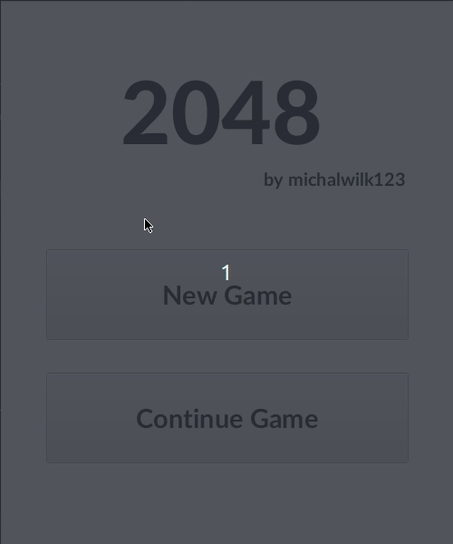
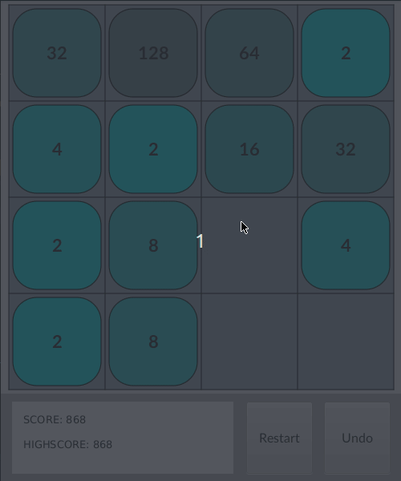

# THE 2048 GAME javafx clone

## FEATURES:
- start menu and end menu
- saving highscore of the players
- option to rollback previous moves (up to 5 steps)
- saving game state
---
### Example gameplay
Below you can see the tile color change and rollback
feature.

---
### End screen
